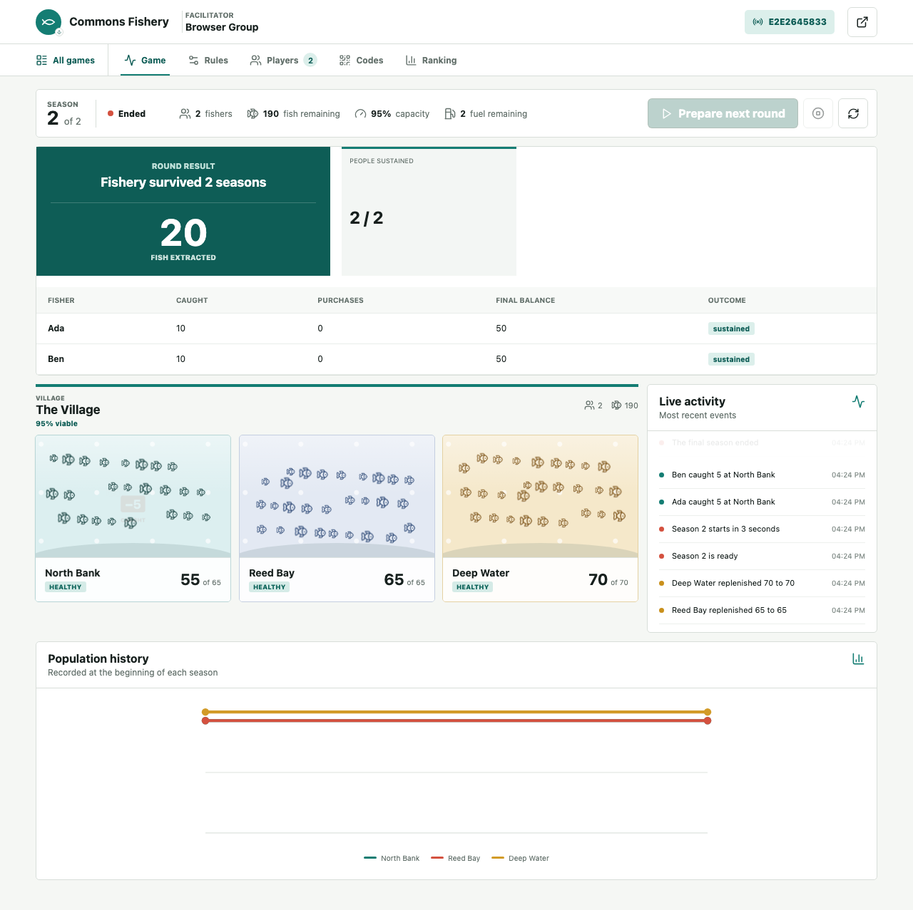

# Commons Fishery

**A Multiplayer Tragedy of the Commons Game**

[](https://github.com/Zsajk/commons-fishery/actions/workflows/ci.yml)
[](LICENSE)

Commons Fishery is an independent, browser-based multiplayer variant of the Tragedy of the Commons fishing game. It supports teaching, demonstrations, experiments, and facilitated group play, with participants joining from their own devices by code or QR code.



## What it supports

- Up to 30 simultaneous groups, each with its own persistent join code.
- One or more configurable rounds with timer-based or fuel-based seasons.
- Multiplier, density-limited, or non-renewing fish populations.
- Configurable capacity, starting stock, food costs, research, feedback, stations, boats, and trading.
- Automatic season transitions once all participants are ready.
- Live facilitator views, participant views, QR codes, collapse outcomes, and cross-group rankings.
- File-based persistence for one-server deployments or PostgreSQL for durable shared storage.
- Role-filtered real-time state so participants do not receive facilitator-only information.

## Quick start

Commons Fishery requires Node.js 20-24 and npm.

```bash
git clone https://github.com/Zsajk/commons-fishery.git
cd commons-fishery
npm ci
npm run dev
```

Open `http://localhost:5180` to join a game or `http://localhost:5180/host` to facilitate one. Local development uses the facilitator PIN `workshop` when no environment variables are set.

For production-style local settings:

```bash
cp .env.example .env
openssl rand -hex 32
```

Put the generated value in `SESSION_SECRET`, choose a private `FACILITATOR_PIN`, and restart the server. Do not commit `.env`.

## Game flow

1. The facilitator creates a session, chooses the number of groups, and configures its rounds.
2. Participants join their group with a code, enter a display name, and mark themselves ready.
3. The facilitator starts the round for all groups with one button and a shared countdown.
4. Participants fish from a shared population during each season.
5. Food is charged and surviving fish reproduce between seasons.
6. Later seasons start automatically after every participant in that group is ready.
7. The final facilitator view compares extraction, survival, collapse, and individual outcomes across groups.

The authoritative mechanics are in [Game Rules](docs/GAME_RULES.md). Facilitator setup, rehearsal, and operations are covered in the [Facilitator Guide](docs/FACILITATOR_GUIDE.md).

## Resource models

**None**

Fish do not replenish. This produces a finite, zero-sum resource.

**Multiplier**

```text
next stock = min(capacity, current stock * rate)
```

**Density-limited**

```text
next stock = current stock + r * current stock * (1 - current stock / capacity)
```

A fully depleted station remains depleted in every model.

## Storage and access

Without `DATABASE_URL`, sessions are stored in `.data/games.json`. This mode is appropriate for local development and a single Node process. Keep exactly one application replica because live timers and WebSocket coordination run in process.

When `DATABASE_URL` is set, Commons Fishery uses PostgreSQL for durable saved games. The current real-time server should still run as one application replica.

Facilitators authenticate with a PIN and receive a signed HTTP-only session cookie. Participants receive a session for their player identity after joining. Treat join codes as session access credentials and avoid using real participant names when pseudonyms are sufficient.

## Deploy with Docker

The recommended stable deployment is one server behind Caddy. The included Compose file runs the application, provisions HTTPS automatically, and stores games in a persistent Docker volume.

1. Point a domain or subdomain at the server's public IP.
2. Open inbound ports 80 and 443. Restrict SSH to trusted addresses where practical.
3. Install Docker and the Docker Compose plugin.
4. Copy `.env.aws.example` to `.env`.
5. Set `APP_DOMAIN`, `FACILITATOR_PIN`, and a random `SESSION_SECRET`.
6. Start the service.

```bash
docker compose up -d --build
docker compose ps
curl https://YOUR_DOMAIN/health
```

The health response should report `"storage":"file"`. The `game_data` volume survives container rebuilds. Back up that volume before an event if saved results matter.

## Deploy on Render

`render.yaml` defines a Node web service and PostgreSQL database. Create a Render Blueprint from the repository, provide `FACILITATOR_PIN`, and let Render generate `SESSION_SECRET`. Review the current service and database plans before relying on them for a live event; sleeping, retention, and pricing policies can change.

## Development

```bash
npm run check
npm test
npm run build
npx playwright install chromium
npm run test:e2e

# With npm run dev running in another terminal:
npm run smoke:workshop
```

The unit tests cover the resource engine, game actions, storage, authorization, and role-specific state views. The Playwright test drives a facilitator and two independent participant sessions through a complete two-season game. GitHub Actions runs checks, unit tests, the production build, and the browser test on every push and pull request.

See [CONTRIBUTING.md](CONTRIBUTING.md) before changing mechanics or opening a pull request. Report security issues according to [SECURITY.md](SECURITY.md).

## Source context

The learning activity is informed by publicly available descriptions of [MIT pSim](https://education.mit.edu/project/toc-psim/) and tragedy-of-the-commons classroom exercises. The code, interface, resource engine, facilitator workflow, and visual assets in this repository are original to Commons Fishery.

Commons Fishery is an independent clean-room implementation. It is not affiliated with, endorsed by, or an official release of MIT or the MIT Scheller Teacher Education Program. No original source code or protected visual assets are included.

Commons Fishery is available under the [MIT License](LICENSE).
